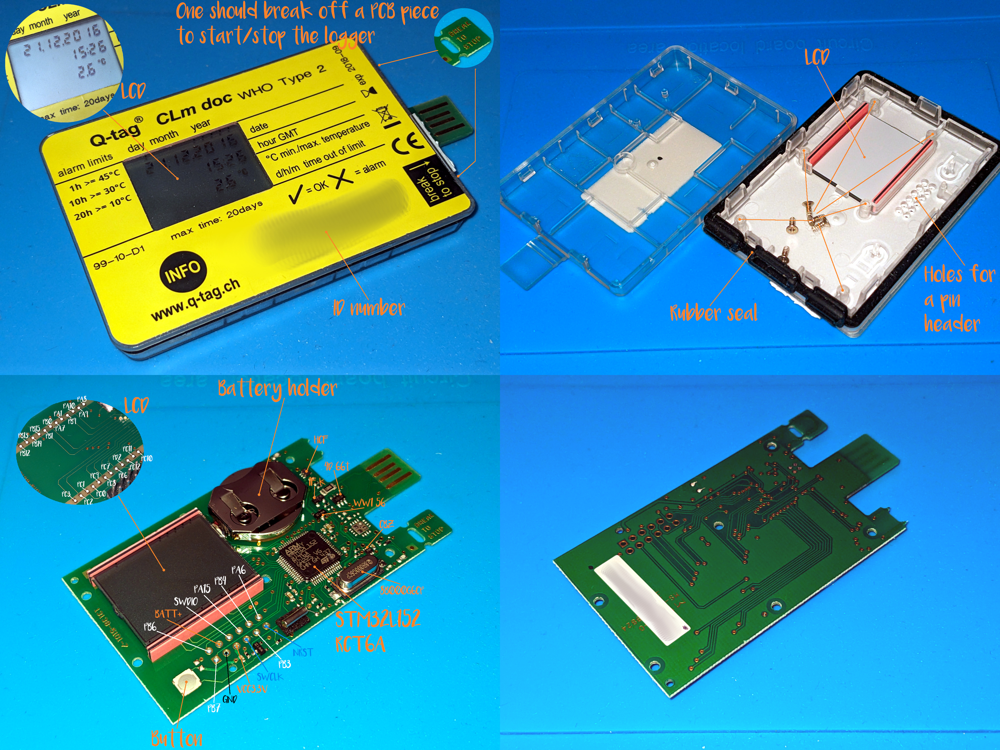

[⮬Contents](../../README.md)

# Q-tag CLm doc

## Official Specifications

These loggers are produced by [Berlinger](https://www.berlinger.com/), a Swiss company that delivers temperature monitoring solutions. There are several [modifications](https://www.manula.com/manuals/berlinger-co-ag/user-manual-q-tag-clm-doc-devices/3/en/topic/2-product-overview)
of them. The official specs of the model I review could be found [here](https://www.berlinger.com/fileadmin/user_upload/temperature_monitoring/2_Solutions/Q-tag_CLm_doc/105_Technical_Specification_CLm_doc.pdf).

## Is it officially re-usable?
Definitely no. Reusable models have suffix &#x201C;R&#x201D;. On Q-tag CLm doc you are supposed to break off PCB tabs to start and stop it. So it turns into a piece of e-waste after usage. Moreover, it usually has an expiration date.

## Is it possible to use it as a devboard?
Believe it or not, but with some reverse engineering you could turn this piece of electronic waste into a nearly equivalent to [$12 worth development board](https://estore.st.com/en/products/evaluation-tools/product-evaluation-tools/mcu-mpu-eval-tools/stm32-mcu-mpu-eval-tools/stm32-discovery-kits/32l152cdiscovery.html).
It's weird for a single use device, but we have an extremely hacker-friendly board with thru-hole pads for standard pin headers for SWD interface and some GPIO. It's how consumer electronics should look like in a perfect world with Right to repair and
everything. You probably will be able to use LCD. Alternatively you might want to use LCD pads to solder some external modules.

## MCU 
Ultra-low-power [STM32L152RCT6A](https://eu.mouser.com/datasheet/2/389/stm32l151qc-1851375.pdf) Cortex&#xAE;-M3 32MHz/256KB flash/32KB SRAM.

## LCD
It gives you 3 lines of 7-segment numbers (date/dime/temperature) and some additional segments. It has rubber connector.

## External flash/EEPROM
None

## Plastic Case
It has **IP65** protection class, the board is secured with six screws, everything could be easily opened and closed without breaking. There are holes for pin headers. Very kind of Berlinger.

[⮬Contents](../../README.md)
