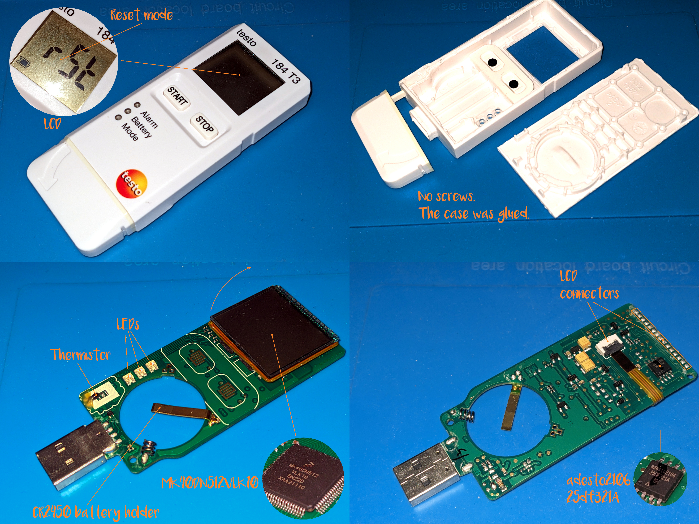

[⮬Contents](../../README.md)

# Testo 184 T3

## Official Specifications

This one is produced by [Die Testo Sensor GmbH](https://www.testo-sensor.de/) which was founded in Germany. There are [three modifications](https://static-int.testo.com/media/1d/ef/1713ebf17722/testo-184T1-T2-T3-Data-sheet.pdf),
and one of them (surprise) is reusable. Namely the [one](https://static-int.testo.com/media/f8/20/3552339a7ed1/testo-184-Instruction-manual.pdf) I happened to pick up.

## Is it officially re-usable?** 
Yes. Only [T3](https://static-int.testo.com/media/f8/20/3552339a7ed1/testo-184-Instruction-manual.pdf) model. T1 and T2 are not. It is configured with a [PDF form](https://static-int.testo.com/media/23/0b/28a6218d432f/testo-184-T3-configuration.pdf) that is available when you insert it to USB port.

## Is it possible to use it as a devboard?
There is no point. But as far as I can see T2 and T3 have similar external cases and are probably similar inside. If you have a single-use Testo T1 or T2 logger and could check it out, please let me know. I have a sneaking suspicion that they might have only firmware difference. So what you find inside is a compact board with [NXP](https://www.nxp.com/) MCU
underneath the LCD, some LEDs, flash chip, thermistor and other stuff. Nothing special compared to other boards. There are soldering flux residues around through-hole components, which does not make it
look like $100+ worth reusable device. However it is, and it deserves my respect. At least until I check out a single use model and compare them. :) There are some PCB test points and I expect they might be
used for debug purposes, however you&#x2019;ll need a special [debug probe](https://www.nxp.com/design/software/development-software/mcuxpresso-software-and-tools-/mcu-link-debug-probe:MCU-LINK) which I don&#x2019;t have at the moment. However it is more affordable
than Microchip debuggers I mentioned earlier.

## MCU
[MK40DN512VLK10](https://www.nxp.com/part/MK40DN512VLK10) Cortex&#xAE;-M4 100MHz/512KB flash/128KB SRAM. 

## LCD
It gives you one line of 7-segment numbers and some additional segments. It has thru-hole pins and a ribbon connector, so it probably may be reused in your projects.

## External flash/EEPROM
[adesto2106 25df321A](https://www.renesas.com/us/en/document/dst/at25df321a-datasheet) serial flash memory chip.

[⮬Contents](../../README.md)

## Plastic Case
It is apparently the same as in a single-use model. It is glued together, so you could not even replace the battery without vandalizing it. A weird solution for a reusable device.

